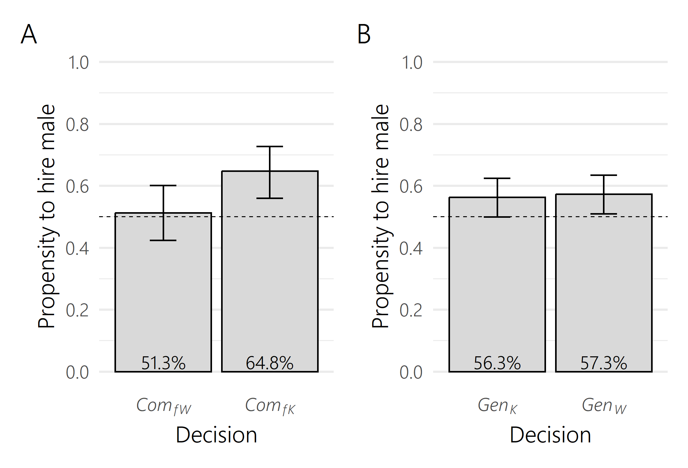
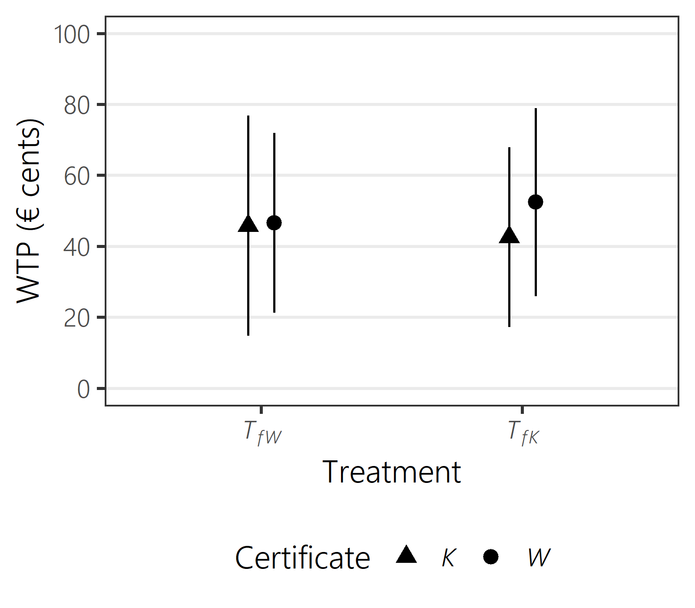
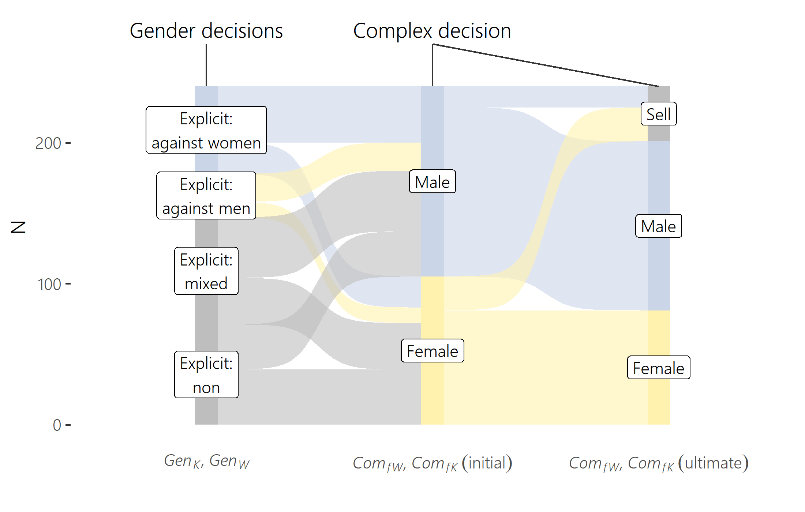

# implicitgender

This repository contains data and analysis code to reproduce results from the article **"Explicit and Implicit Belief-Based Gender Discrimination: A Hiring Experiment"**.

<body> 
 

 
   
   
   

 
 
</body> 

## R scripts

R scripts to reproduce all analyses from the article can be found in the `/R` folder. The script `functions.R` is a helper script with customized R functions imported into the main analysis script `analysis.R`. The latter script outputs some simple computational results into the console on the fly, but also exports multiple tables and figures into the folders `/latextables` and `/figures`.

## Data

In the `/data` folder, the file `candidates.xlsx` contains data from the first experiment (the job candidate assessment). The file `hiring.xlsx` contains data from the second experiment (hiring experiment). The tables below explain all variables. 

#### Data dictionary `candidates.xlsx`

Column name                 | Description                                            
-----------------------------|-----------------------------------------------------------
sessionid                   | Session number   
participant                 | Unique participant identifier   
time_started                | Starting date and time of experiment for participant
generalknowledge            | Total score in the knowledge task
wordpuzzles                 | Total score in the word task                           
matrices                    | Total score in the logic task                           
age                         | Participant's age (years)  
gen                         | Participant's gender (1 = female, 2 = male)
stud                        | Participant's university study program
estimate_matrices           | Belief about performance of male participants in logic task (% won by male vs. female participant)
belief_matrices             | Belief about others' belief about performance of male participants in logic task (average % won by male vs. female participant)
payofftotal                 | Participant's total realized payoff including show-up fee (Euro)

#### Data dictionary `hiring.xlsx`

Column name                   | Description                                            
------------------------------|-----------------------------------------------------------
participant                   | Unique participant identifier   
date                          | Date of experiment
sessionid                     | Session number
treatapp1_choice              | Randomized treatment with respect to complex decision (1 = TfW, 2 = TfK)
dec[1-9]                      | Initial choice in the respective decision (1 = male candidate, 0 = female candidate; in the certificate decisions, 1 = knowledge candidate, 0 = word candidate)
indif[1-9]                    | Choice whether to sell the respective decision (1 = yes, 0 = no)
frame[1-9]                    | Placement of male candidate (in the certificate decisions, of knowledge candidate) as candidate A or candidate B on the screen
position[1-9]                 | Position in the decision sequence at which the respective decision was presented to the participant
scaleknow                     | Informativeness rating of knowledge certificate for job task (1-5)
scaleword                     | Informativeness rating of word certificate for job task (1-5)
knowoffer1                    | Price list offer for the knowledge certificate 0.1 Euro (1 = accepted, 0 = declined)
knowoffer2                    | Price list offer for the knowledge certificate 0.2 Euro (1 = accepted, 0 = declined)
knowoffer3                    | Price list offer for the knowledge certificate 0.3 Euro (1 = accepted, 0 = declined)
knowoffer4                    | Price list offer for the knowledge certificate 0.4 Euro (1 = accepted, 0 = declined)
knowoffer5                    | Price list offer for the knowledge certificate 0.5 Euro (1 = accepted, 0 = declined)
knowoffer6                    | Price list offer for the knowledge certificate 0.6 Euro (1 = accepted, 0 = declined)
knowoffer7                    | Price list offer for the knowledge certificate 0.7 Euro (1 = accepted, 0 = declined)
knowoffer8                    | Price list offer for the knowledge certificate 0.8 Euro (1 = accepted, 0 = declined)
knowoffer9                    | Price list offer for the knowledge certificate 0.9 Euro (1 = accepted, 0 = declined)
knowoffer10                   | Price list offer for the knowledge certificate 1.0 Euro (1 = accepted, 0 = declined)
wordoffer1                    | Price list offer for the word certificate 0.1 Euro (1 = accepted, 0 = declined)
wordoffer2                    | Price list offer for the word certificate 0.2 Euro (1 = accepted, 0 = declined)
wordoffer3                    | Price list offer for the word certificate 0.3 Euro (1 = accepted, 0 = declined)
wordoffer4                    | Price list offer for the word certificate 0.4 Euro (1 = accepted, 0 = declined)
wordoffer5                    | Price list offer for the word certificate 0.5 Euro (1 = accepted, 0 = declined)
wordoffer6                    | Price list offer for the word certificate 0.6 Euro (1 = accepted, 0 = declined)
wordoffer7                    | Price list offer for the word certificate 0.7 Euro (1 = accepted, 0 = declined)
wordoffer8                    | Price list offer for the word certificate 0.8 Euro (1 = accepted, 0 = declined)
wordoffer9                    | Price list offer for the word certificate 0.9 Euro (1 = accepted, 0 = declined)
wordoffer10                   | Price list offer for the word certificate 1.0 Euro (1 = accepted, 0 = declined)
age                           | Participant's age (years) 
gender                        | Participant's gender (1 = female, 2 = male)
study                         | Participant's university study program as free text
totalpayoff                   | Participant's total realized payoff including show-up fee (Euro)
study_coded                   | Participant's university study program coded into broad categories (econ = Economics/Business, stem = STEM, other = all other programs)

## Code for lab experiment

In the folder `/oTree`, oTree program files are deposited that were used to run the experimental sessions. The folder `oTree/stimuli` contains the program for the job candidate assessment (Experiment 1). The folders `oTree/hiring_cluster1`, `oTree/hiring_cluster2`, `oTree/hiring_cluster3` and `oTree/hiring_cluster4` contain the programs which, in this sequence, were used for the hiring experiment (Experiment 2). 

